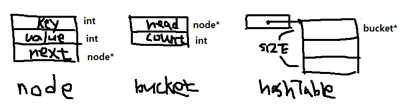

### 사용된 자료구조

`struct node`은 data block의 역할을 하기 위해 `key`과 `value`를 가지고 있으며, 
**체이닝**의 문제를 해결하기 위한 링크  `next`를 가지고 있다.

`struct bucket`은 `node`를 위한 자료구조이며, 첫 번째 노드를 가리키기 위한 `head`와
`hashTable`의 총 `bucket` 갯수를 세기 위한 `count` 변수를 가지고 있다.

`bucket* hashTable`은 메모리 할당을 통해 `bucket`의 공간을 만들 때
포인터 역할을 하기 위한 자료구조이다.
