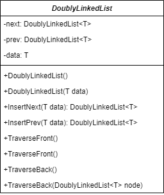
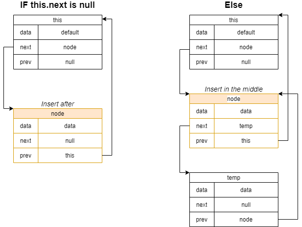
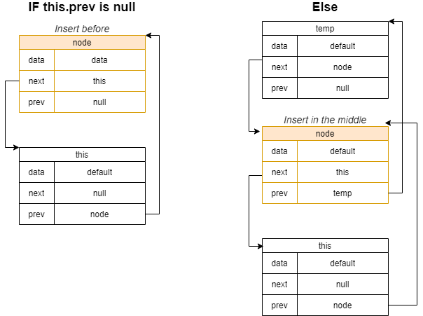
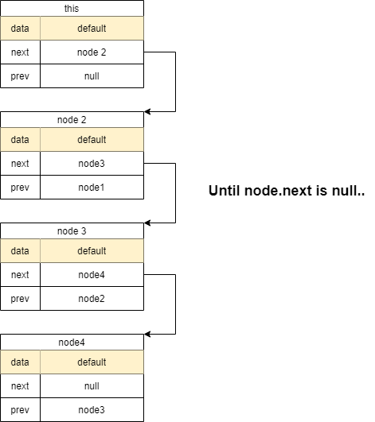
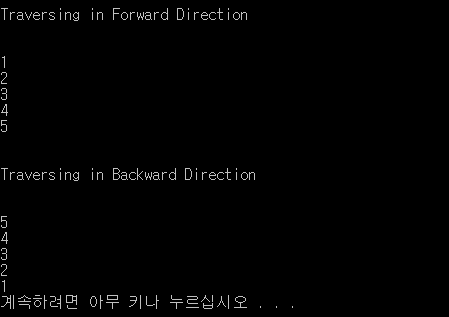

## 클래스
<br/>
이전 노드를 참조하기 위한 `prev` 속성과 이후 노드를 참조하기 위한 `next` 속성이 있고, 데이터를 저장하기 위한 `data` 속성이 있다.  
생성자로 아무 인자를 받지 않을 시, `T`에 따른 `default` 값과, `next`와 `prev` 속성을 `null`로 결정하고, `data`를 인자로 받을 경우 `this.data = data`를 해준다.

---

## 메소드

```cs
public DoublyLinkedList<T> InsertNext(T data)
{
    DoublyLinkedList<T> node = new DoublyLinkedList<T>(data);

    if (this.next == null)
    {
        node.prev = this;
        node.next = null;
        this.next = node;
    }
    else
    {
        // Insert in the middle
        DoublyLinkedList<T> temp = this.next;
        node.prev = this;
        node.next = temp;
        this.next = node;
        temp.prev = node;
    }
    return node;
}
```
<br/>
메소드 안에서 `DoublyLinkedList<T> node` 인스턴스를 생성한다.  
메소드를 호출한 `this`에서 다음 노드를 가리키지 않을 경우, `this`뒤에 `node`를 연결한다.
`this.next != null`이라면 임시로 `this.next`를 저장할 `DoublyLinkedList<T> temp` 인스턴스를 생성하고 `node`를 `this` 뒤에, `temp`를 `node` 뒤에 배치하여 연결해준다.  
```cs
public DoublyLinkedList<T> InsertPrev(T data)
{
    DoublyLinkedList<T> node = new DoublyLinkedList<T>(data);

    if (this.prev == null)
    {
        node.prev = null;
        node.next = this;
        this.prev = node;
    }
    else
    {
        // Insert in the middle
        DoublyLinkedList<T> temp = this.prev;
        node.prev = temp;
        node.next = this;
        this.prev = node;
        temp.next = node;
    }
    return node;
}
```
<br/>
메소드 안에서 `DoublyLinkedList<T> node` 인스턴스를 생성한다.  
메소드를 호출한 `this`에서 이전 노드를 가리키지 않을 경우, `this`와 `node`를 서로 연결해준다.  
`this.prev != null`이라면 임시로 `this.prev`를 저장할 `DoublyLinkedList<T> temp` 인스턴스를 생성하고 `node`를 `temp` 뒤에, `this`를 `node` 뒤에 배치하여 서로 연결해준다.  
```cs
public void TraverseFront()
{
    TraverseFront(this);
}
```
이전 노드를 **재귀호출**을 이용하여 출력해준다.  
```cs
public void TraverseFront(DoublyLinkedList<T> node)
{
    if (node == null)
        node = this;

    Console.WriteLine("\n\nTraversing in Forward Direction\n\n");

    while (node != null)
    {
        Console.WriteLine(node.data);
        node = node.next;
    }
}
```
<br/>
`node`를 인자로 받지 못할 경우, `node`에는 `this`가 할당되도록 한다.  
`node != null` 아닐동안에만 `node.data`를 출력하고, 그 다음 노드를 탐색하기 위해 `node=node.next`를 해준다.  
```cs
public void TraverseBack()
{
    TraverseBack(this);
}
```
이후 노드를 **재귀호출**을 이용하여 출력해준다.  
```cs
public void TraverseBack(DoublyLinkedList<T> node)
{
    if (node == null)
        node = this;

    Console.WriteLine("\n\nTraversing in Backward Direction\n\n");

    while (node != null)
    {
        Console.WriteLine(node.data);
        node = node.prev;
    }
}
```
`public void TraverseFront(DoublyLinkedList<T> node)`와 같은 원리이지만, `node = node.prev`를 한다는 점이 다르다.

---

## 테스트
```cs
namespace ConsoleAppCsharp
{
    class Program
    {
        static void Main(string[] args)
        {
            DoublyLinkedList<int> node1 = new DoublyLinkedList<int>(1);
            DoublyLinkedList<int> node3 = node1.InsertNext(3);
            DoublyLinkedList<int> node2 = node3.InsertPrev(2);
            DoublyLinkedList<int> node5 = node3.InsertNext(5);
            DoublyLinkedList<int> node4 = node5.InsertPrev(4);

            node1.TraverseFront();
            node5.TraverseBack();
        }
    }
}
```
