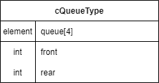
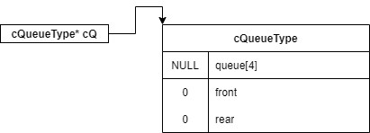
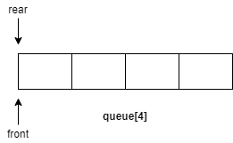
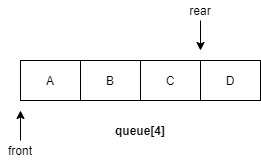
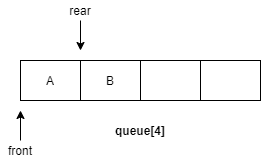
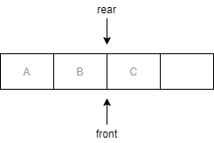
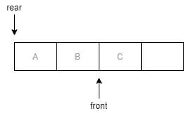
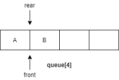
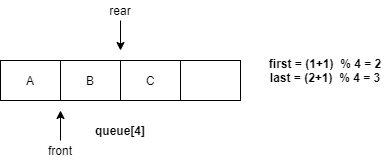

### 자료구조
 
큐의 사이즈는 4, 큐의 앞을 가리키는 `front`, 큐의 뒤를 가리키는 `rear`
상수 4는 `define`을 통해 `CQ_SIZE`라는 매크로 상수로 정의해놓았다.

---

### 함수
#### 1. cQueueType* createQueue();
 

`cQueueType`포인터 `cQ`를 만든 뒤에 `malloc` 함수로 힙에서 `cQueueType`만큼의 메모리를 할당받아 `cQ`에 메모리 주소를 저장한다.
초기화를 위해 `front`와 `rear`는 각각 0으로 **같은 값**으로 하였다.

#### 2. int isEmpty(cQueueType* cQ);
 

큐의 `front`와 `rear` 값이 완전히 같은경우 *Circular Queue is empty!*
메시지 출력 후 `return 1`을 하여 프로그램을 종료 한다.

#### 3. int isFull(cQueueType* cQ);
 
`rear+1`에서 큐의 사이즈인 4 만큼 모듈러 연산한 값이 `front`값과 동일하다면 *Queue is Full!* 메시지 출력 후 `return 1`을 하여 프로그램을 종료 한다.

`(cQ->rear+1) % CQ_SIZE`을 하게 될 경우 `LinearQueue`같이 `front`와 `rear`가 같다고 포화상태로 잘 못 인식하는 경우를 없앨 수 있다. 추후에 설명할 `void enQueue(cQueueType* cQ, element item)` 참고

#### 4. void enQueue(cQueueType* cQ, element item);
 
큐가 포화상태면 프로그램을 종료한다.
그렇지 않으면 `(cQ->rear + 1) % CQ_SIZE`을 하여 `rear` 값을 늘리고, `queue[rear]`에 인자로 받은 `item`값을 저장한다.

 
연산에서 `(cQ->rear + 1) % CQ_SIZE`을 하게 되는 이유는 간단하다. 
예를들어 왼쪽 그림과 같이 큐가 삭제 연산으로 인해 `front`와 `rear`가 3이라고 가정하자, 현재 A,B,C는 삭제 연산으로 인해 사라진 상태이다.

큐에 삽입연산을 할 때 `rear`값을 1 증가시키고, 큐의 사이즈만큼 모듈러 연산을 하게 되면 `rear`**값은 큐의 사이즈내에서만 값이 변화하게 되며** 최종적으로 `rear`가 다시 0으로 오게되어 마치 **원형**의 구조를 가지게된다.
추후에 나올 삭제연산, 피크출력, 큐의 모든 원소 출력도 같은 이유로 모듈러 연산을 한다.

단, 이러한 연산과정때문에 큐의 사이즈보다 1 적게 쓸 수 밖에 없다는 단점이 있어 메모리가 낭비된다.

#### 5. element deQueue(cQueueType* cQ);
 
큐가 빈 상태면 프로그램을 종료한다.
그렇지 않으면 `cQ->front = (cQ->front + 1) % CQ_SIZE`를 하여 `front`값을 늘린다.
그리고 `front`가 가리키는 원소를 반환한다.

#### 6. void del(cQueueType* cQ);
`element deQueue(cQueueType* cQ)`에서 `return`이 없는 형태

#### 7. element peek(cQueueType* cQ);
큐가 빈 상태면 프로그램을 종료한다.
그렇지 않으면 `return cQ->queue[(cQ->front + 1) % CQ_SIZE];`

#### 8. void printQ(cQueueType* cQ);
 
`first`가 `last`와 같지 않을때까지 큐의 모든 원소를 출력한다.
