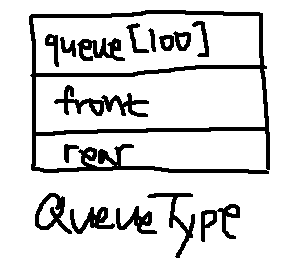
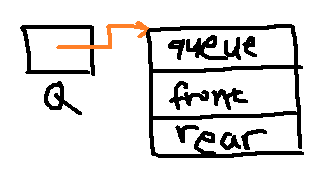
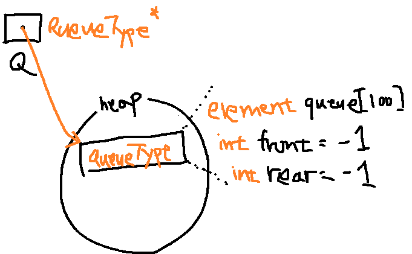

### 자료구조
 
`front`부터 `rear`까지 `queue`를 순회하기 위해 `int front`와 `int rear`가 존재
자료를 저장할 데이터는 순차 자료구조(배열)이고, 자료형은 `element`, `queue`의 기본 사이즈는 100

 
`QueueType* Q`는 포인터 역할을 하기 위해 정의

---
### 함수
#### 1. QueueType* createQueue()
 
힙 메모리에서 `queueType` 만큼의 메모리를 할당받음
여기서는 단순 큐 생성이기 때문에 `front`와 `rear`를 같은 값인 -1로 초기화
같은 값으로 초기화 하는 이유는 큐 안에 아무것도 없음을 알림을 의미함

#### 2. int isFull(QueueType* Q)
`rear`의 크기가 100보다 하나 작은 99인 경우 *Queue is Full!*

#### 3. int isEmpty(QueueType* Q)
`front`와 `rear`가 같은 값일 경우 *Queue is Empty!*

#### 4. void enQueue(QueueType* Q, element item)
`int isFull(QueueType* Q)`가 `True`을 반환할경우 프로그램 종료
그게 아니라면 큐의 끝부터 데이터를 저장하기 위해, `rear` 값을 증가시키고, `queue[rear]`에 `item`을 저장한다.

#### 5. element deQueue(QueueType* Q)
`int isEmpty(QueueType* Q)`가 `True`을 반환할경우 프로그램 종료
그게 아니라면 `queue[front]` 부터 탐색하지 않기 위해 `front` 값을 증가시킨 후, `queue[front]` 반환

#### 6. void del(QueueType* Q)
`element deQueue(QueueType* Q)`에서 `return` 값이 없음

#### 7. element peek(QueueType* Q)
`int isEmpty(QueueType* Q)`가 `True`을 반환할경우 프로그램 종료
그게 아니라면 `queue[front + 1]` 반환

#### 8. void printQ(QueueType* Q)
`queue[front+1]`부터 `queue[rear]`까지 순회하면서 데이터 출력