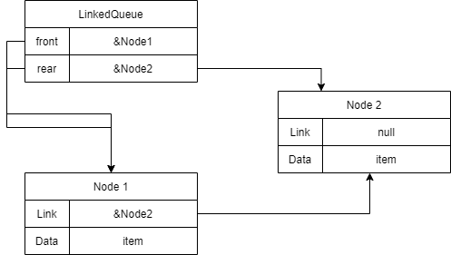

## 자료구조
`1. LinkedQueue<T>`<br/>
<br/>
큐의 앞 링크와 뒷 링크를 저장할 `private Node front`와 `private Node rear`로 구성
메서드는 삽입, 삭제, 피크 기능이 있고, 각 연산을 시도할 수 있는지 확인할 수 있는 메서드 또한 존재한다.<br/>
`2. Node`<br/>
<br/>
`Node` 클래스는 생성자 호출 시 모든 필드를 초기화시킬수 있다.
모든 필드는 `get`이 가능하다.
하지만 `Data`의 경우 `set`이 불가능하며, `Link` 또한 같은 어셈블리에서만 `set`이 가능하다.

---

## 메서드
```cs
public void Enqueue(T item)
```

먼저 `Node` 인스턴스인 `node`를 생성한다.
`LinkedQueue`의 `rear`가 아무것도 가리키지 않는다면 큐가 비어있는 상태이므로<br/><br/>


`front`와 `rear`를 생성한 `node`를 가리키도록 한다.
만약 이미 `rear`가 누군가를 가리키고 있다면 큐가 비어있지 않은 상태이므로<br/><br/>


`rear`를 새로 생성한 `node`를 가리키도록 하고,
기존에 `rear`가 가리키던 노드는 새로 생성한 `node`와 연결해야하므로
`rear.Link`에도 `node`를 가리키도록 한다.

```cs
public T peek()
```
`front`가 아무도 가리키지 않는다면, 예외처리로 *Queue is empty.* 를 출력
그게 아니라면, `front.Data`를 리턴한다.

```cs
public bool TryPeek(out T item)
```
`front`가 아무도 가리키지 않는다면, `item` 값을 초기화를 시켜주고 `false`를 리턴한다.
그게 아니라면, `item`값에 `front`가 가지고 있는 `Data`를 저장하고, `true`를 리턴한다.

```cs
public T Dequeue()
```

`front`가 아무도 가리키지 않는다면, 예외처리로 *Queue is empty.* 를 출력
그게 아니라면, `front.Data`를 `T item`에 저장하고,
`front`를 기존에 `front`와 이어진 링크로 바꿔서 연결을 끊는다.
그리고 연결이 끊긴 노드의 데이터를 `return`

```cs
public void Printqueue()
```

`front`가 가리키는 첫 번째 노드의 `Link`가 `NULL`이 될 때까지 노드의 `Data`를 출력하고, 반복문이 넘어가기전에 `front = front.Link;`를 하여, `front`가 가리키는 노드가 옮겨갈수 있도록 한다.