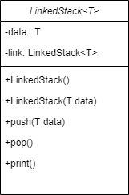
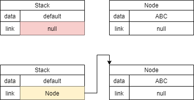
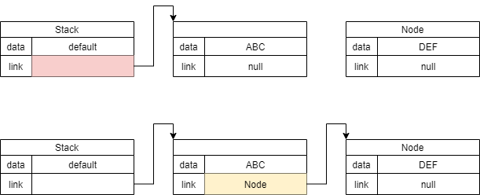
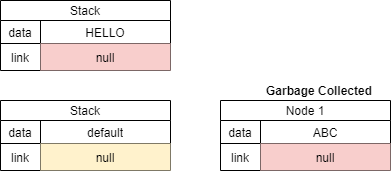
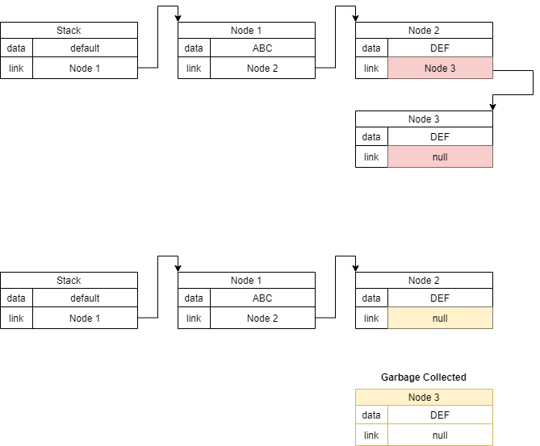

## 자료구조
  
데이터를 저장할 `T data`와 노드를 이어줄 `link`로 구성했다.  
<span style="color:red">이렇게 구성할 경우 노드가 하나라면 `pop` 호출 시 참조한 객체를 `null`로 만들 수 밖에 없는 의도하지 않은 문제가 발생하게 된다. 이 문제를 해결하기 위해선 연결 리스트와 같이 첫 노드를 가리키는 헤드를 따로 저장했어야 했다..</span>

---

## 메소드
```cs
public void push(T data)
{
    LinkedStack<T> node = new LinkedStack<T>(data);

    if (this.link == null)
        this.link = node;
    else
    {
        LinkedStack<T> temp = this;
        while (temp.link != null)
            temp = temp.link;
        temp.link = node;
    }
}
```
#### 1. 객체가 다른 노드와 연결되있지 않은 경우
  
생성한 객체에 아무도 연결되어있지 않을 경우, 생성한 객체에 `node`를 연결해준다.

#### 2. 객체가 다른 노드와 이미 연결된 경우
  
생성한 객체가 미리 연결된 경우, `link`를 순차적으로 탐색하여  
`link`가 `null`인 노드에 `node`를 연결해준다.  

```cs
public void pop()
{
    if (this.link == null)
    {
        Console.WriteLine("Sorry. You can't empty the stack.");
        return;
    }
        
    if (this.link.link == null)
    {
        this.link = null;
        return;
    }

    LinkedStack<T> temp = this.link;
    while (temp.link.link != null)
        temp = temp.link;
    temp.link = null;
}
```
#### 1. 예외 처리
  
노드가 하나일 경우엔 삭제를 할 수 없다는 메시지를 출력하고 함수를 종료한다.  
노드가 두 개 일 경우엔, 현재 객체의 `link`를 `null`로 만들어 다음 노드를 참조하지 않게한다.

#### 2. 그 외

다음 다음 노드의 `link`가 `null` 인 것을 탐색한다.  
다음 다음 노드의 `link = null` 일 경우, 다음 노드의 `link`을 `null`로 만들어 연결을 끊어버린다. 

```cs
public void print()
{
    LinkedStack<T> _this = this;
    Console.Write("Stack: < ");
    while (_this != null)
    {
        Console.Write(_this.data + " ");
        _this = _this.link;
    }
    Console.WriteLine(">");
}
```
현재(처음) 노드를 저장할 임시 인스턴스 `_this`를 저장하고,  
현재 노드가 `null`일때까지 노드의 `data`를 출력하는데,  
 `_this`를 `_this = _this.link`를 하여 현재 노드에서 다음 노드로 넘어가게 한다.